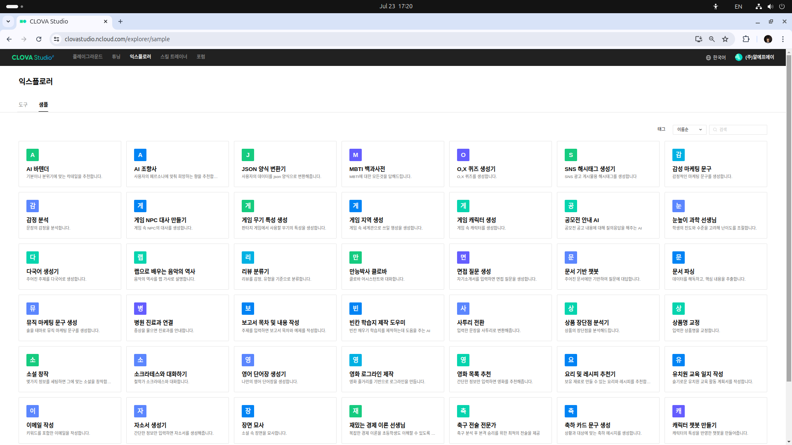

# 프롬프트 엔지니어링 쉽게 접근해보기

- [ ] 적용 사례(플레이그라운드 샘플 42개)

프롬프트 적용 사례 42개를 구글 gemini 모델을 사용하여 파이썬 코드로 만들어 보자. 

https://pitch-eel-0ef.notion.site/15d0711f396d8088b21dc9b21597cec8?source=copy_link

https://aistudio.google.com/prompts/new_chat